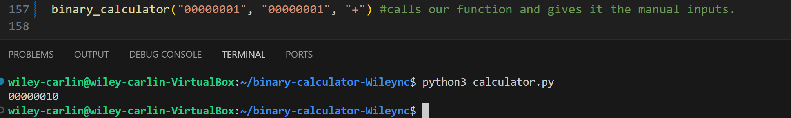
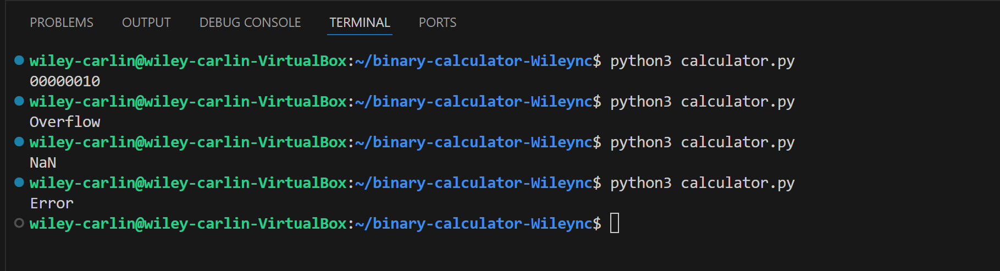

# Binary Calculator

This code acts as a calculator that can add, subtract, multiply or divid two binary codes. As an example, 10000000 + 00111111 would return 10111111. This allows us to do the hard math of binary codes simply without the use of conversion to numbers and then back to binary.

## How does it work?
This code works by taking in 3 things, 2 are binary codes such as 10101010 and 00011111, and in an operation including " + ", " - ", " * ", or " / ". The code then takes the two binary codes and converts them into a number. For example: 10101010 is 170 and 00011111 is 31. Then the code would use the sign, such as " + " and put it between the numbers. It does the math, 170 + 31 = 201, to then return a binary string equal to the output, 201 ---> 11001001.

## Testing
To test our code, we write...
```
pytest calculator.py test_calculator.py
```
This first takes our calculator file and inputs different binary codes and signs from the test_calculator file.


In this picture we see that the function is called and were adding 00000001 and 00000001, both of these being equal to 1, we get 00000010 also equal to 2. This is simply 1 + 1 = 2.

## Possible outputs:

1. If the inputs works and both numbers using the sign outputs a number between 0 and 255, then the code would turn that number into binary code and return that, outputs like "10011010"

2. If the output is greater than 255 or less than 0, the code will return the word "Overflow", this is beause 8-bit binary can only support numbers between 0 and 255. Any numbers greater than or less than those boundries cannot be represented by a single binary code.

3. If the second binary code that is input is equal to 0, than the code will return the word "NaN" meaning "not a number"

4. If the either of the two binary codes that are input have any characters that aren't a 1 or 0, then the code returns the word "Error"
## Running the code Manually:
To run the code manually, one would go to the line...
```
binary_calculator("00000001", "00000001", "+")
```
...and change the binary codes and operation to the desired values, one would then run this command:
```
python3 calculator.py
```